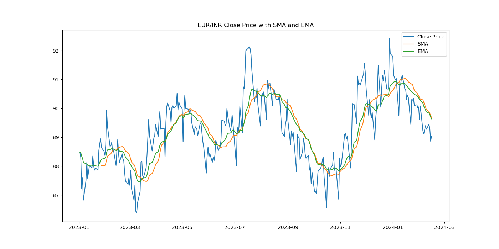

<h1 align="center">Yahoo Finance
</h1>
<h2 align="center">Objective: Analyse the trend of EUR/INR for the upcoming day and week using technical indicators</h2>

1. Scrape the EUR/INR currency data from Yahoo Finance, covering the period from January 1, 2023, to February 16, 2024.
 

  
2. Conduct a technical analysis and calculate the following metrics for one day and one week from February 16, 2024
 
<h4 align="left">- Moving Average </h4> 

<h4 align="left">- Bollinger Band </h4> 

<h4 align="left">- CCI (Commodity Channel Index)</h4> 

  

3. Based on the results of the technical indicators, make a decision to BUY, SELL or remain NEUTRAL? for the specified time frames.

 

